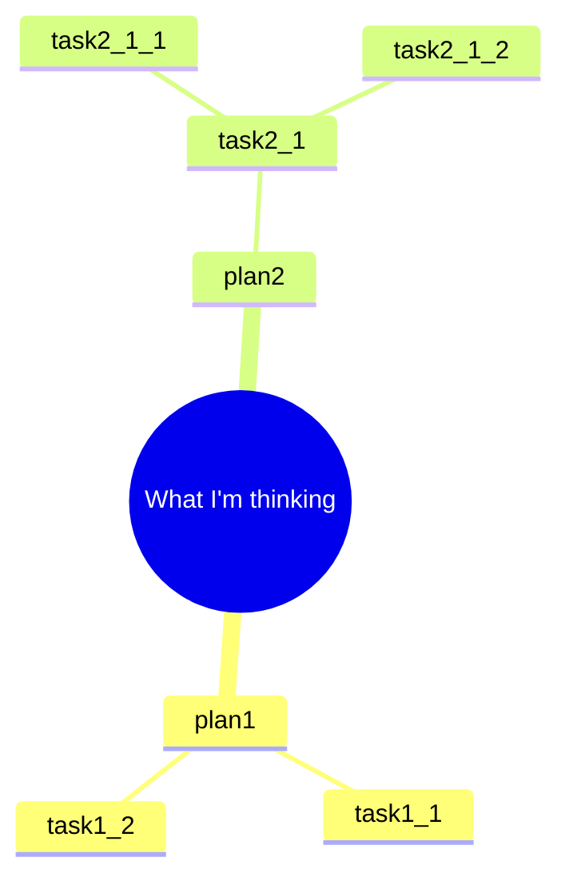

```mermaid
    mindmap
        root((What I'm thinking))
            plan1
                task1_1
                task1_2
            plan2
                task2_1
                    task2_1_1
                    task2_1_2
```
